# DevOps Observability Final Project

A containerized Flask application with a local DevOps stack for monitoring, logging, alerting, health checks, environment automation, security scanning, and recovery documentation.

## Final Deliverable

Repository link: https://github.com/ZuraKajaia565/DevOps

Live application link: `https://<your-render-service>.onrender.com`

Replace the placeholder above with the real Render URL after the first successful deployment.

## Tech Stack

| Area | Tools |
| --- | --- |
| Web application | Python 3.12, Flask |
| UI/API | Flask routes, HTML forms, JSON endpoints |
| Unit testing | Pytest |
| Linting | Ruff |
| Containerization | Docker, Docker Compose |
| Free-tier hosting | Render web service |
| Monitoring | Prometheus, Grafana |
| Logging | Loki, Promtail, JSON structured logs |
| Alerting | Prometheus alert rules, Grafana-managed alert rules |
| Security automation | pip-audit, Trivy, Gitleaks, Hadolint |
| IaC / automation | Docker Compose, PowerShell automation scripts |
| CI/CD | GitHub Actions |

## Architecture

The project runs completely locally with Docker Compose:

| Component | Purpose | Local URL |
| --- | --- | --- |
| Flask app | Demo service with UI, `/error`, `/health`, and `/metrics` endpoints | http://localhost:5000/ui |
| Prometheus | Scrapes application metrics and evaluates alert rules | http://localhost:9090/graph |
| Grafana | Dashboards, log exploration, and alert visibility | http://localhost:3000 |
| Loki | Stores application logs; accessed through Grafana or Loki API | http://localhost:3100/ready |
| Promtail | Ships JSON log files from the app container to Loki | Internal service |


### CI/CD Workflow Diagram

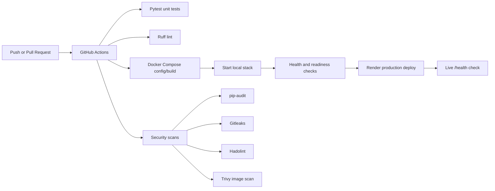

Data flow:

1. The Flask app exposes `app_requests_total` and `app_errors_total` at `/metrics`.
2. Prometheus scrapes the app every 15 seconds and evaluates `HighErrorRate`.
3. The app writes JSON logs to `/var/log/app/app.log`.
4. Promtail tails that log file and sends entries to Loki.
5. Grafana is provisioned with Prometheus and Loki datasources plus an application dashboard.
6. Grafana is also provisioned with a managed `HighErrorRate` alert rule backed by Prometheus.

## Observability Lab Coverage

| Requirement | Implementation |
| --- | --- |
| Docker Compose infrastructure | `docker-compose.yml` runs the app, Prometheus, Grafana, Loki, and Promtail. |
| Single-command deployment | `powershell -NoProfile -ExecutionPolicy Bypass -File .\scripts\setup.ps1` or `docker compose up --build -d`. |
| Dynamic web application | Flask app includes `/ui`, `/hello/<name>`, and `/feedback`. |
| Input form/endpoint | `/feedback` provides an HTML form and accepts `POST` input. |
| Automated unit test | `app/tests/test_app.py` covers health, dynamic route, and feedback endpoint behavior. |
| Metrics monitoring | Prometheus scrapes `http://app:5000/metrics`; Grafana uses the provisioned Prometheus datasource. |
| Logging pipeline | The app writes JSON logs, Promtail ships them to Loki, and Grafana Explore queries them. |
| Custom instrumentation | `app_requests_total` and `app_errors_total` are exposed at `/metrics`. |
| Proactive alerting | `HighErrorRate` fires when `rate(app_errors_total[1m]) > 0.0833`, which is more than 5 errors per minute. |
| CI test and lint | GitHub Actions runs `pytest` and `ruff check` on every push and pull request. |
| Blue-green deployment | `scripts/deploy-blue-green.ps1` deploys local blue/green production slots. |
| Rollback | `scripts/rollback-blue-green.ps1` switches back to the previous healthy slot. |
| Periodic health monitoring | `scripts/monitor-health.ps1` writes health-check results to `logs/health-check.log`. |
| Evidence | Screenshots are stored in `screenshots/` and linked in the Evidence section below. |

## Quick Start

PowerShell:

```powershell
powershell -NoProfile -ExecutionPolicy Bypass -File .\scripts\setup.ps1
```

Bash or manual Docker Compose:

```bash
cp .env.example .env
docker compose up --build -d
```

Default service access:

- Application UI: http://localhost:5000/ui
- Application API root: http://localhost:5000
- Dynamic route example: http://localhost:5000/hello/student
- Feedback form: http://localhost:5000/feedback
- Application health check: http://localhost:5000/health
- Application metrics: http://localhost:5000/metrics
- Prometheus UI: http://localhost:9090/graph
- Prometheus targets: http://localhost:9090/targets
- Prometheus alerts: http://localhost:9090/alerts
- Grafana UI: http://localhost:3000
- Grafana alert rule: http://localhost:3000/alerting/grafana/high-error-rate/view
- Grafana health API: http://localhost:3000/api/health
- Loki readiness API: http://localhost:3100/ready

Note: Loki does not provide a browser dashboard at `http://localhost:3100/`. Query logs from Grafana Explore using the Loki datasource, or use Loki API endpoints directly.

Prometheus `/graph` opens with an empty query box by default. Enter one of these PromQL expressions and click **Execute**:

- `up`
- `app_requests_total`
- `app_errors_total`
- `rate(app_errors_total[1m])`
- `rate(app_requests_total[1m])`

Grafana credentials are read from `.env`. The default demo values are in `.env.example`; change `GRAFANA_ADMIN_PASSWORD` before using this outside a local evaluation environment.

## Environment Automation

The project is reproducible on another machine with Docker and Docker Compose:

- `scripts/setup.ps1` creates `.env` from `.env.example`, builds images, starts all services, and runs validation.
- `scripts/validate.ps1` checks the app health endpoint, UI, dynamic route, feedback form, metrics endpoint, Prometheus readiness, Grafana health, Loki readiness, and Compose service state.
- `docker-compose.yml` defines every required service, network, volume, port, and startup relationship.

Automation scripts:

| Script | Purpose |
| --- | --- |
| `scripts/setup.ps1` | Prepares directories/configuration, builds containers, starts the stack, and validates it. |
| `scripts/validate.ps1` | Performs automated post-deployment checks. |
| `scripts/security-scan.ps1` | Runs dependency, image, and secret scans. |
| `scripts/deploy-blue-green.ps1` | Deploys a local blue or green production slot. |
| `scripts/rollback-blue-green.ps1` | Rolls back to the previous healthy slot. |
| `scripts/monitor-health.ps1` | Periodically checks health and writes results to a log file. |

Validation can also be run independently:

```powershell
powershell -NoProfile -ExecutionPolicy Bypass -File .\scripts\validate.ps1
```

## CI/CD and Deployment Workflow

The GitHub Actions workflow in `.github/workflows/devops-quality.yml` runs on pushes and pull requests:

1. Install Python dependencies.
2. Run unit tests with `pytest`.
3. Run linting with `ruff check`.
4. Validate Docker Compose configuration.
5. Build the Flask application image.
6. Start the full observability stack.
7. Verify application, Prometheus, Grafana, and Loki endpoints.
8. Run dependency, secret, Dockerfile, and container image security scans.
9. Deploy to Render only on pushes to `main`, and only after all previous jobs pass.

Local deployment uses the same Docker Compose definition as CI:

```powershell
powershell -NoProfile -ExecutionPolicy Bypass -File .\scripts\setup.ps1
```

Branching strategy:

- `main` or `master` is the stable submission branch.
- `dev` is the active integration branch.
- Feature work should be completed on short-lived branches such as `feature/security-automation` or `feature/reliability-checks`.
- Pull requests run the CI/security workflow before merging.
- Rollback work should use a dedicated branch such as `rollback/fix-current-incident`.
- Commits should be frequent, clean, and descriptive, for example `Add health monitor script` or `Provision Grafana alert rule`.

Continuous deployment approach:

- The project uses Render free-tier hosting for cloud deployment and local Docker containers for evaluation.
- CI builds and starts the complete Docker Compose stack.
- CI verifies the deployed services through health and readiness endpoints.
- The same deployment command can be run by an evaluator on another machine.
- Render deployment is triggered by a GitHub Actions deploy hook only after tests, linting, Compose validation, and security scans pass.
- Local production deployment is simulated with blue-green slots:

```powershell
powershell -NoProfile -ExecutionPolicy Bypass -File .\scripts\deploy-blue-green.ps1 -Target blue
powershell -NoProfile -ExecutionPolicy Bypass -File .\scripts\deploy-blue-green.ps1 -Target green
```

- Blue slot runs on http://localhost:5101.
- Green slot runs on http://localhost:5102.
- The active slot is recorded in `logs/production-active.txt`.
- Roll back to the previous running slot:

```powershell
powershell -NoProfile -ExecutionPolicy Bypass -File .\scripts\rollback-blue-green.ps1
```

### Render Deployment Setup

1. Create a free Render account.
2. Create a new **Web Service** from the GitHub repository.
3. Use Docker deployment with `render.yaml`.
4. Set the service health check path to `/health`.
5. In Render, create a deploy hook for the service.
6. In GitHub repository settings, add these secrets:

| Secret | Value |
| --- | --- |
| `RENDER_DEPLOY_HOOK_URL` | The Render deploy hook URL. |
| `LIVE_APP_URL` | The deployed Render app URL, for example `https://your-service.onrender.com`. |

The deploy job is intentionally restricted to pushes on `main`:

```yaml
needs: [test-and-lint, validate, security]
if: github.event_name == 'push' && github.ref == 'refs/heads/main'
```

That means a failing test, lint issue, broken Docker Compose stack, or failed security scan blocks production deployment.

### Update Strategy

Cloud deployment uses a **recreate strategy** on Render because the free tier usually runs a single web instance. The release risk is reduced by:

- Running tests and lint before deployment.
- Running Docker Compose validation before deployment.
- Running security scans before deployment.
- Using `/health` as a production health check.
- Keeping local blue-green deployment scripts as a release-strategy simulation.

For local release simulation, use blue-green deployment:

- Blue slot: http://localhost:5101
- Green slot: http://localhost:5102
- Active slot: `logs/production-active.txt`

### Render Rollback Guide

If a bug is discovered in production:

1. Open the Render dashboard.
2. Select the web service.
3. Open the **Deploys** tab.
4. Find the last known good deploy.
5. Click **Rollback** or redeploy the previous successful commit.
6. Wait until Render reports the deploy as live.
7. Verify the app:

```bash
curl https://your-service.onrender.com/health
curl https://your-service.onrender.com/ui
```

8. If needed, revert the bad commit in Git:

```bash
git revert <bad-commit-sha>
git push origin main
```

The GitHub Actions pipeline will then run again and deploy only if the reverted version passes all checks.

To stop the environment:

```bash
docker compose down
```

To remove local volumes as well:

```bash
docker compose down -v
```

## Security Automation

Security checks are integrated into CI and can also be run locally.

CI security tools:

- `pip-audit` scans Python dependencies in `app/requirements.txt`.
- `gitleaks` scans the repository for committed secrets.
- `hadolint` validates Dockerfile security and best practices.
- `Trivy` scans the built application container image for high and critical vulnerabilities.

Local security scan:

```powershell
powershell -NoProfile -ExecutionPolicy Bypass -File .\scripts\security-scan.ps1
```

Runtime hardening:

- Grafana credentials are configurable through `.env` instead of being fixed in Compose.
- `.env` is ignored by Git to avoid committing local secrets.
- Containers use `no-new-privileges:true`.
- The application image runs as a non-root user.
- The app container has a Docker health check.

## Automated Tests

Run unit tests locally:

```powershell
cd app
pip install -r requirements.txt -r requirements-dev.txt
pytest
ruff check .
```

The tests verify the health endpoint, dynamic route, feedback input endpoint, and validation behavior.

## Implementation Details

Metrics:

- `/metrics` exposes Prometheus metrics.
- Prometheus scrapes the app every 15 seconds.
- Grafana uses the provisioned Prometheus datasource for dashboards.

Logging:

- The app writes JSON-structured logs containing timestamp, logger, level, endpoint, method, status, duration, and error fields.
- Promtail ships `/var/log/app/*.log` to Loki.
- Logs can be queried in Grafana Explore with `{job="app"}`.

Alerting:

- `HighErrorRate` fires when `rate(app_errors_total[1m]) > 0.0833` for 1 minute.
- This threshold represents roughly more than 5 errors per minute.
- The rule is configured in Prometheus and also provisioned as a Grafana-managed alert rule.

Simulate the alert:

```bash
./simulate_alert.sh
```

Manual Windows alternative:

```powershell
1..30 | ForEach-Object { Start-Job { Invoke-WebRequest -UseBasicParsing http://localhost:5000/error | Out-Null } }
```

View the alert in:

- Grafana: http://localhost:3000/alerting/grafana/high-error-rate/view
- Prometheus: http://localhost:9090/alerts

## Reliability Improvements

Reliability additions for the final project:

- App-level `/health` endpoint.
- Docker health check for the Flask app.
- `restart: unless-stopped` for core services.
- Prometheus readiness endpoint validation.
- Automated post-deployment checks in `scripts/validate.ps1`.
- Periodic health-check logging in `scripts/monitor-health.ps1`.
- CI deployment verification after Compose startup.
- Incident response and rollback procedure in `docs/incident-response.md`.

Run periodic health monitoring:

```powershell
powershell -NoProfile -ExecutionPolicy Bypass -File .\scripts\monitor-health.ps1 -Count 12 -IntervalSeconds 10
```

Health results are written to `logs/health-check.log`.

Rollback summary:

```bash
git log --oneline
git switch -c rollback/fix-current-incident
git revert <faulty-commit-sha>
docker compose up --build -d
```

Then run:

```powershell
powershell -NoProfile -ExecutionPolicy Bypass -File .\scripts\validate.ps1
```

## Evidence

The screenshots below demonstrate that the application, observability stack, alerting, and deployment automation are working together locally.

### Application UI

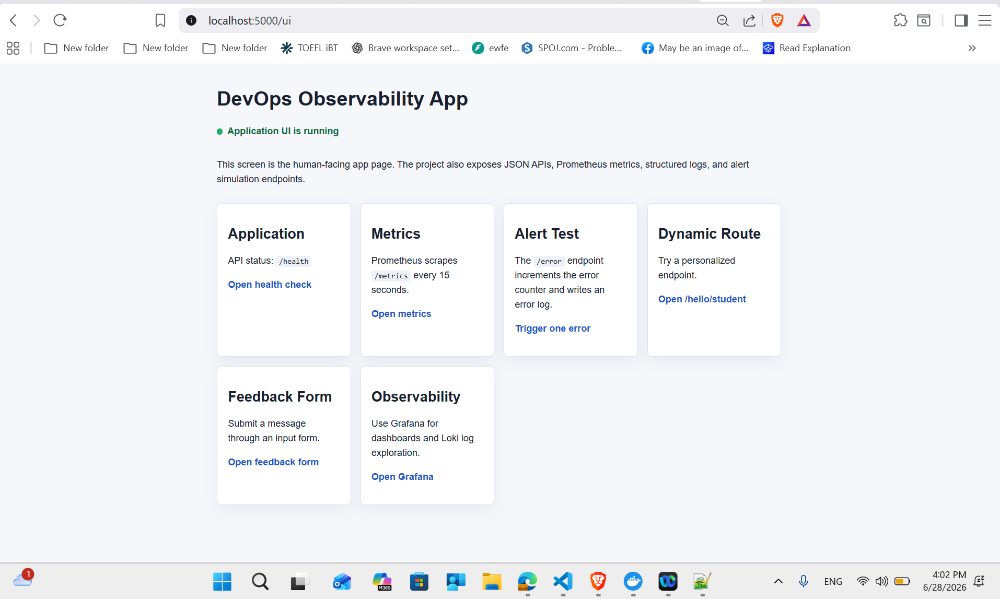

Shows the Flask application's browser UI. This proves the containerized web app is reachable locally and provides a usable screen in addition to API endpoints.

### Application Response

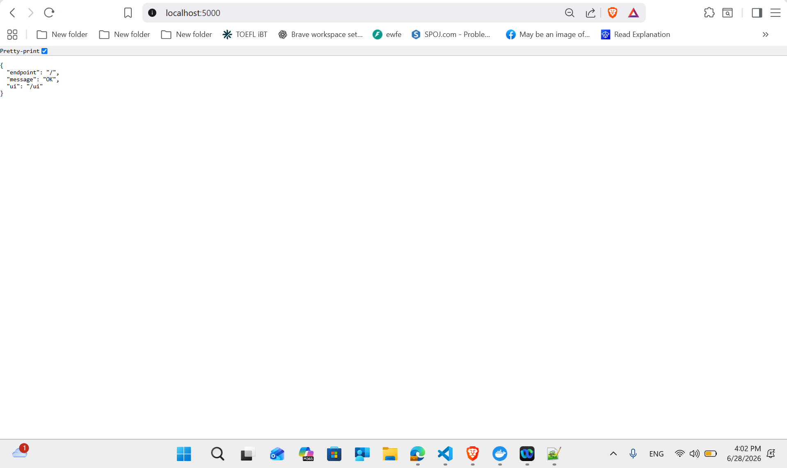

Shows the running application responding through the local Docker-published port.

### Test Requests Sent

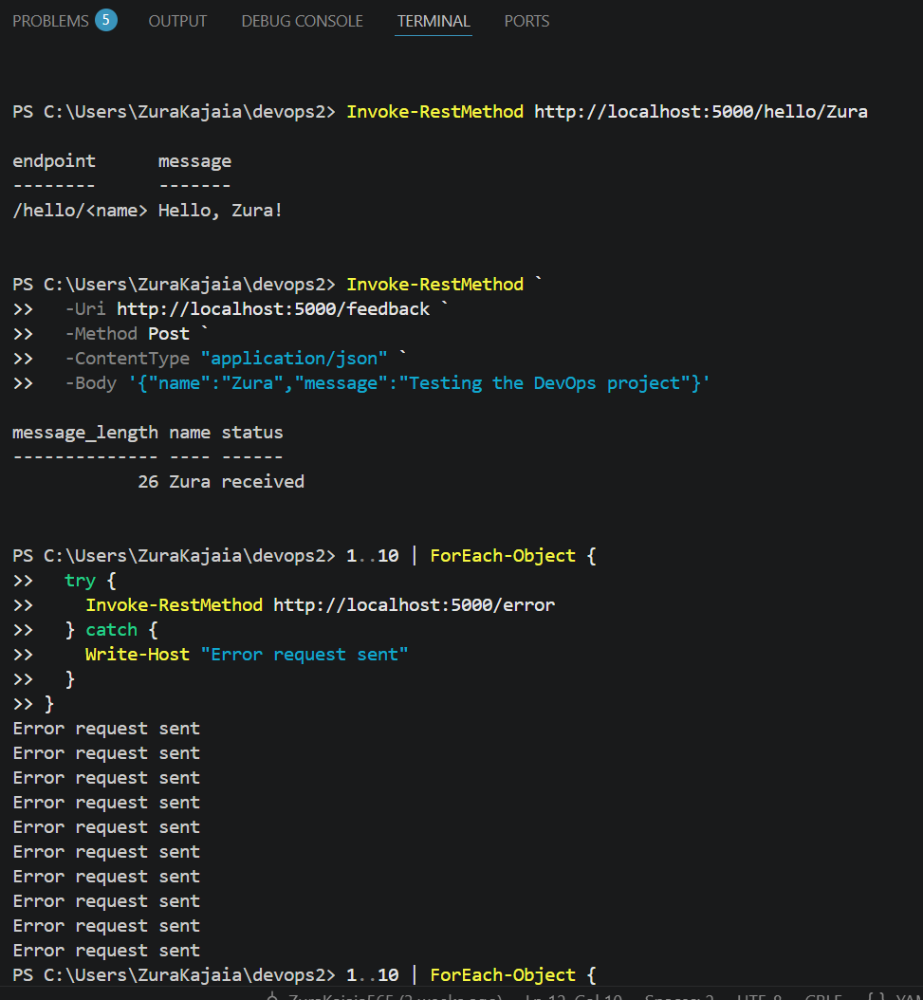

Shows manual traffic being sent to the app. These requests increase Prometheus counters and generate JSON log entries for Loki.

### Prometheus Metrics

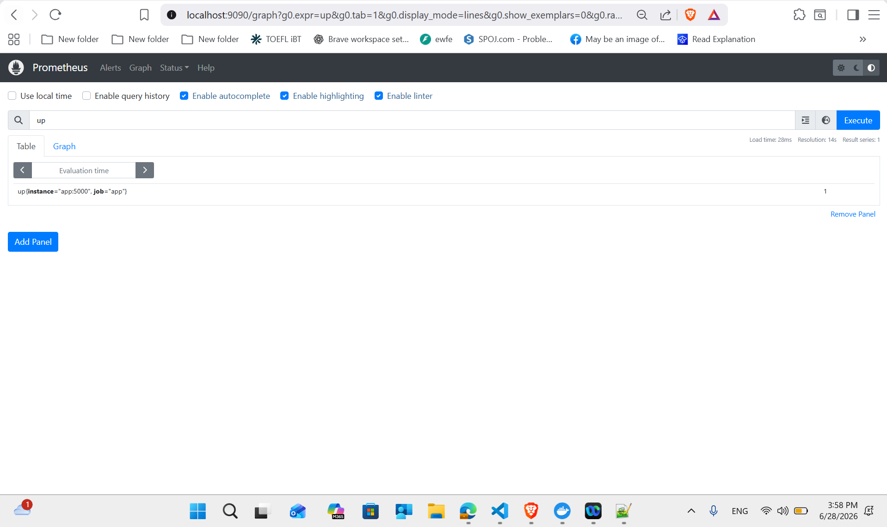

Shows Prometheus querying application metrics collected from the Flask `/metrics` endpoint.

### Grafana Dashboard

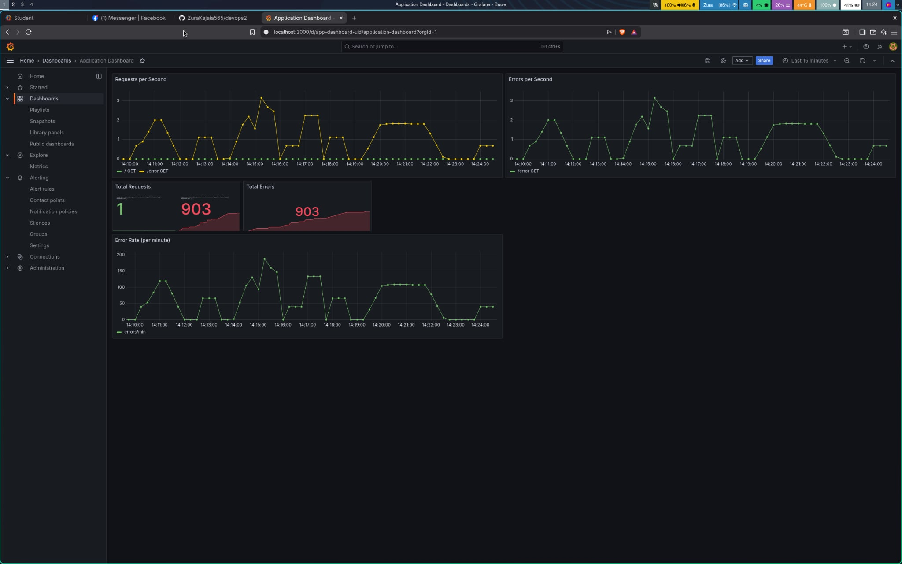

Shows Grafana visualizing custom Prometheus application metrics such as request and error counters.

### Grafana UI

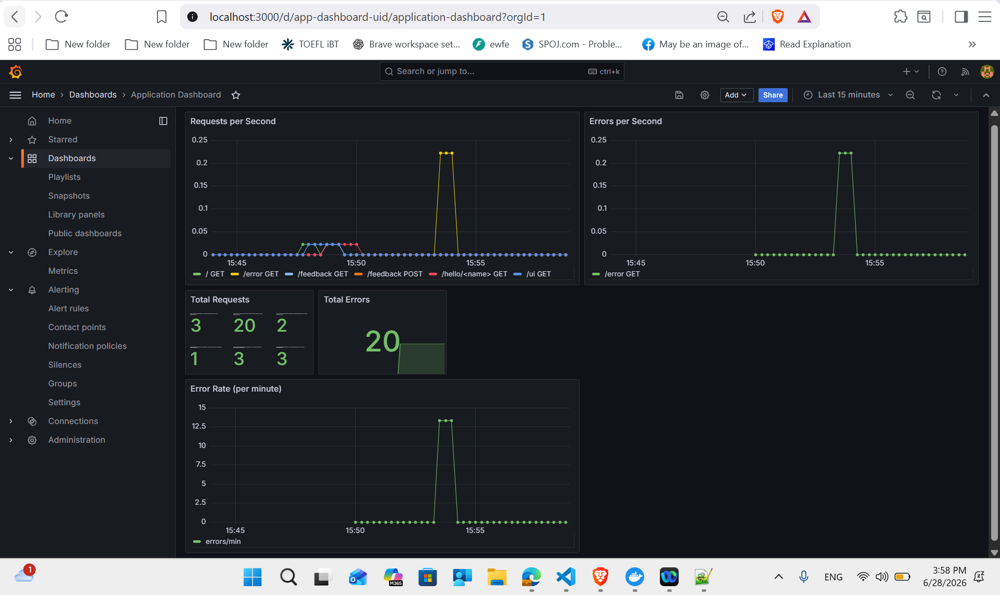

Shows Grafana running as the visualization layer for dashboards, logs, and alerts.

### Log Analysis

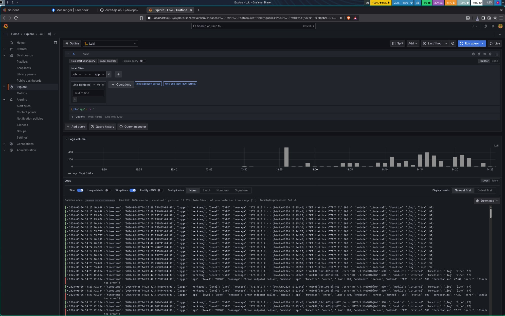

Shows Grafana Explore querying Loki logs that were emitted by the Flask app in JSON format.

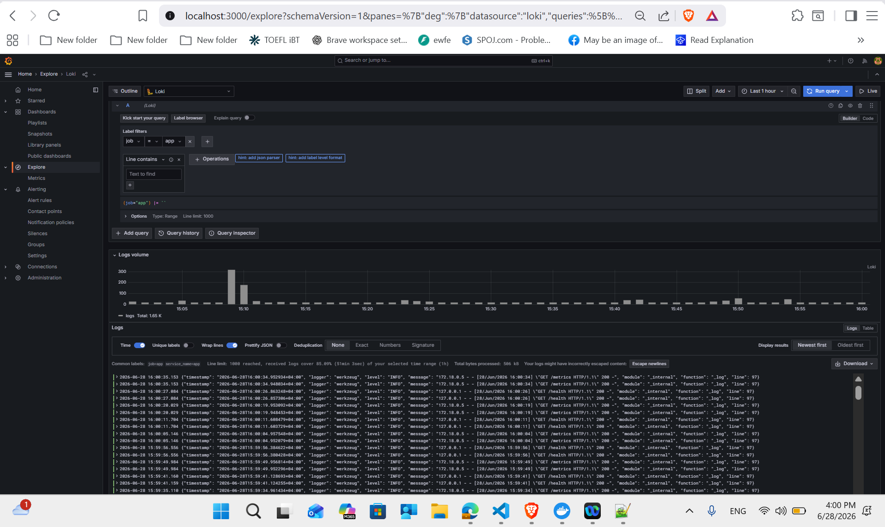

Shows filtered application logs in Grafana Explore, confirming that Promtail is shipping JSON logs into Loki.

### Loki Readiness

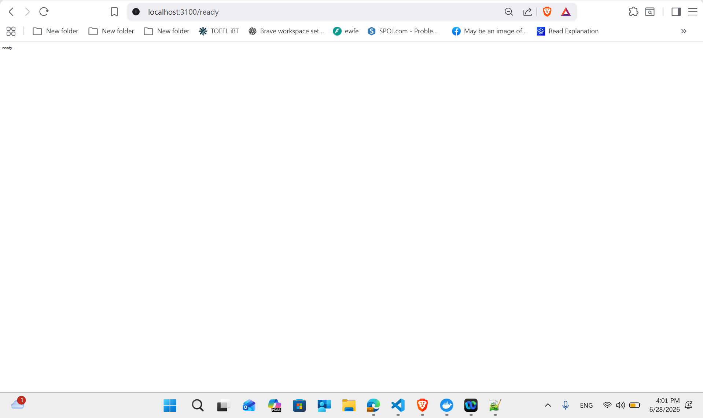

Shows the Loki readiness endpoint responding locally. Loki is the log storage backend used by Grafana Explore.

### Alerting Rules

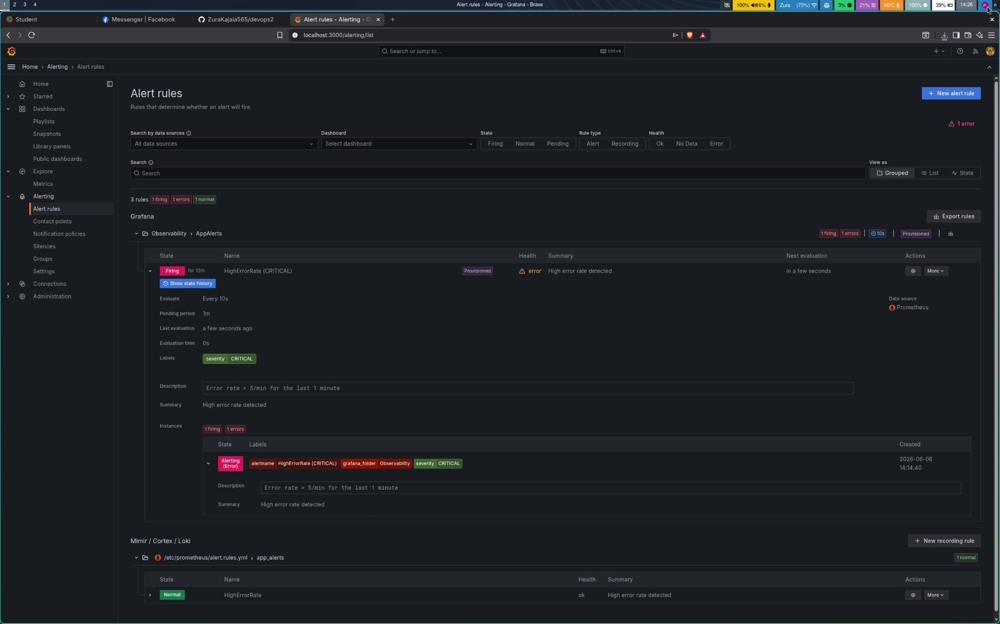

Shows the configured alerting rule for high application error rate.

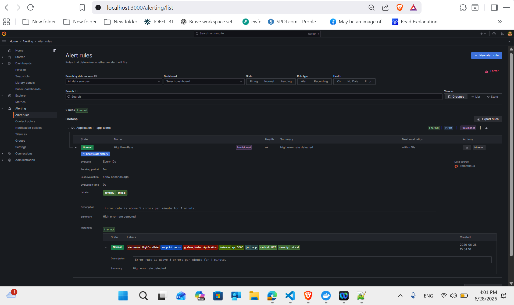

Shows the Grafana-managed `HighErrorRate` alert rule used to detect excessive application errors.

### Alert Simulation

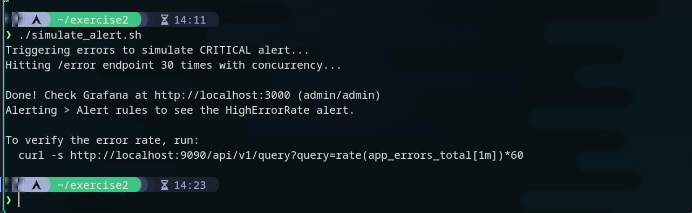

Shows the alert simulation script generating `/error` traffic.

### Blue-Green Deployment

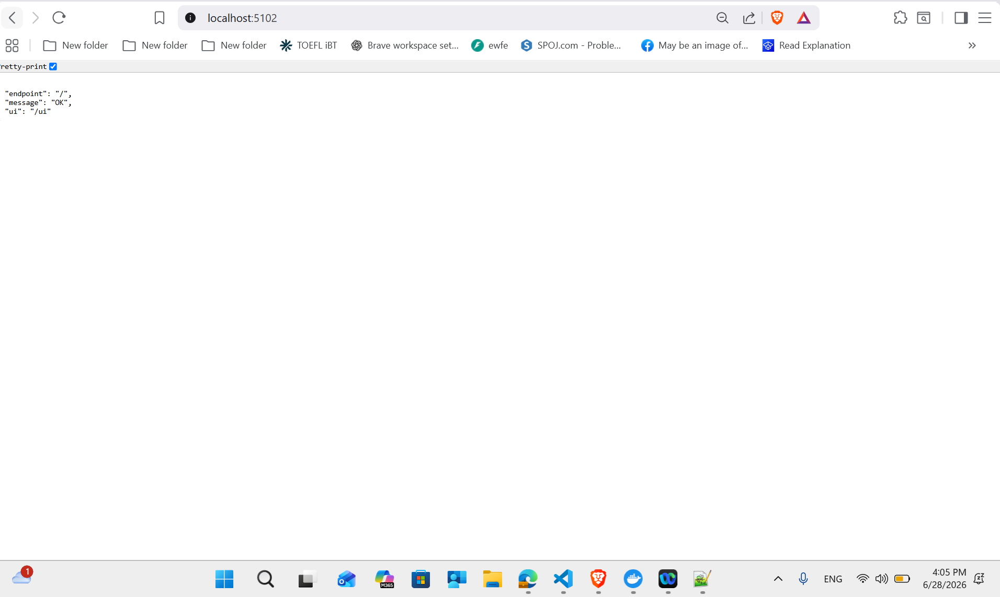

Shows the green deployment slot becoming active. This demonstrates the local blue-green deployment strategy.

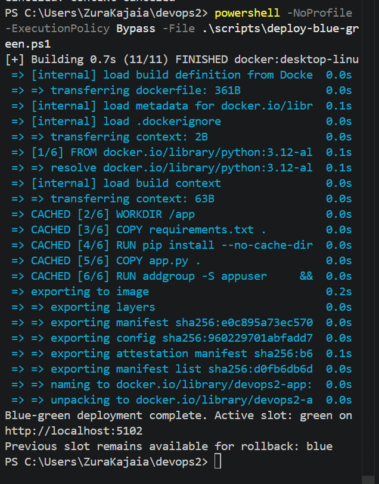

Shows the active production simulation slot responding after deployment.

### Rollback Evidence

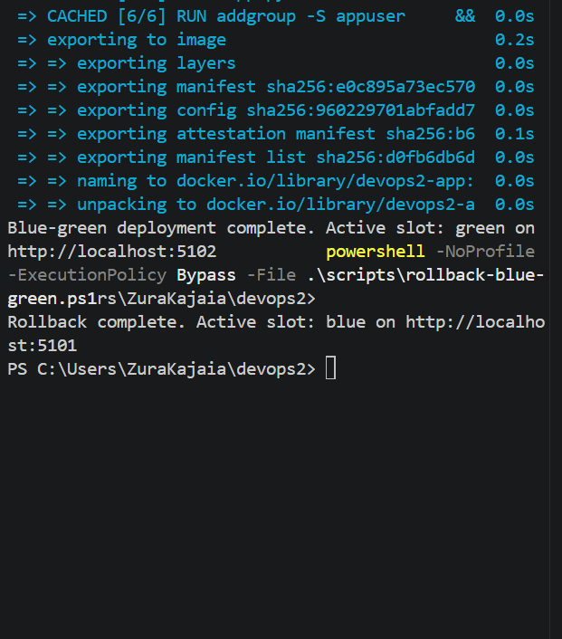

Shows rollback from the newer slot to the previous healthy slot, proving the recovery procedure works locally.

## Existing Functionality Preserved

This final project keeps the previously implemented DevOps functionality operational:

- Git-based project structure.
- Docker and Docker Compose local execution.
- Prometheus monitoring.
- Grafana dashboards.
- Loki and Promtail logging.
- JSON structured logs.
- Alert rules and alert simulation.
- Application health checks.

## Evaluation Checklist

Use these commands when evaluating locally:

```powershell
powershell -NoProfile -ExecutionPolicy Bypass -File .\scripts\setup.ps1
powershell -NoProfile -ExecutionPolicy Bypass -File .\scripts\validate.ps1
powershell -NoProfile -ExecutionPolicy Bypass -File .\scripts\security-scan.ps1
```

The security scan downloads free public scanner images and may take longer on the first run.

## Analysis

### Why is JSON-structured logging more efficient than plain text logs?

JSON logs are more useful than plain text logs because each event has a consistent machine-readable schema. Loki and Grafana can filter by fields such as `level`, `endpoint`, `status`, and `duration_ms` without fragile text parsing. This makes searches, dashboards, and alert rules more reliable because tools do not need to guess where important values are located in a free-form message.

### What is the fundamental technical difference between Prometheus and Loki?

Prometheus and Loki solve different observability problems. Prometheus stores numeric time-series data and is best for alerting on rates, counters, and service health trends. Loki stores individual log events and is best for debugging the exact request or error that happened at a specific time. Prometheus answers questions like "is the error rate too high?", while Loki answers questions like "what exact error log was written when the alert fired?"

### How would long-term log retention be handled without depleting disk resources?

For longer log retention, this project would move Loki storage from local filesystem volumes to object storage such as MinIO, S3, or another compatible backend. Retention policies should keep high-value error logs longer than low-value debug logs, while Prometheus keeps aggregated metrics for trend analysis. A practical setup would keep recent logs on fast local storage, compact older chunks, and expire logs automatically after the required retention window.
